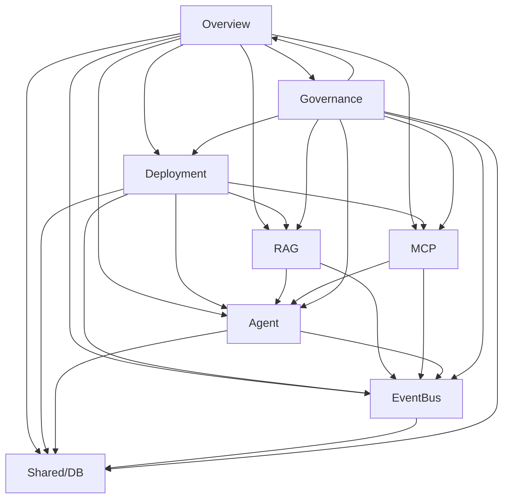

# Documentation Checks

## Purpose

This document defines the automated and manual checks that validate the quality, consistency, and correctness of the LLM agent design documentation set. It ensures documentation remains aligned with implementation and maintains structural integrity.

## Automated Checks

### 1. Document Quality Check (`check_docs_quality.py`)

Checks all documents under `docs/*.md` for quality issues.

**Core checks:**
- Broken headings (malformed section headers)
- Malformed Markdown tables
- Unclosed inline code blocks
- JSON examples without fence markers
- Duplicate heading numbers
- Resolved issue mentions in active documents

**Custom rules:**
- Dynamically loaded from `config/doc_quality_rules.json`

**Usage:**
```bash
python tools/check_docs_quality.py                          # run all core + custom
python tools/check_docs_quality.py --core-only              # only core checks
python tools/check_docs_quality.py --custom-only            # only custom rules
python tools/check_docs_quality.py --skip broken_headings   # skip specific check
python tools/check_docs_quality.py --only stale_patterns    # only specific check
python tools/check_docs_quality.py docs/*.md                # check specific files
```

### 2. Domain Consistency Check (`check_docs_consistency.py`)

Checks consistency between documentation and source code for each domain.

**Domains:**
- `agent` — Agent-related docs vs `scripts/agent/`
- `mcp` — MCP server docs vs `scripts/mcp_servers/`
- `rag` — RAG docs vs `scripts/rag/`
- `deployment` — Deployment docs vs config/deployment files
- `overview` — Overview docs vs overall project structure

**Checks performed per domain:**
- Schema drift (DB schema vs documented schema)
- Config key presence (documented config keys exist in actual config)
- Port drift (documented ports match actual configuration)
- Tool name drift (documented tool names match actual implementations)
- Crawler config drift (documented crawler configs match actual configs)
- Debug output existence (documented debug outputs exist)
- DB count claim (documented DB counts match actual)
- DB table completeness (documented tables exist in actual DB)
- Command drift (documented commands match actual CLI commands)
- File path references (documented file paths exist)
- Function references (documented function signatures match actual)
- Broken internal links (`.md` links resolve correctly)
- Removed file references (references to deleted files detected)

**Usage:**
```bash
python tools/check_docs_consistency.py --domain agent              # check agent docs
python tools/check_docs_consistency.py --domain mcp                # check mcp docs
python tools/check_docs_consistency.py --domain rag                # check rag docs
python tools/check_docs_consistency.py --domain deployment         # check deployment docs
python tools/check_docs_consistency.py --domain overview           # check overview docs
python tools/check_docs_consistency.py --domain agent --skip schemadrift  # skip a check
```

### 3. Needs Confirmation Inventory Check (`check_needs_confirmation_inventory.py`)

Verifies the NC inventory stays in sync with `docs/*.md`.

**Checks:**
- "Needs confirmation" mentions in docs are registered in the centralized inventory (`00_governance_03_issue-and-uncertainty-management.md`)
- Resolved NC items do not leave markers in source documents
- Field count declarations match actual list item counts

### 4. Backward Compatibility Check (`check_compat_shims.py`)

Checks for stale compatibility layers left behind after API migrations.

**Scanned directories:**
- `scripts/`
- `docs/`
- `tests/`
- `tools/`

### 5. Suppression Justification Check (`check_suppression_justification.py`)

Validates that `# noqa`, `# type: ignore`, and `# nosec` comments have proper rule/error-code justification with em-dash separator.

**Scanned directories:**
- `scripts/`
- `tests/`

### 6. Docstring Format Check (`check_docstrings.py`)

Validates Python module-level docstring format in `scripts/`.

**Checks:**
- Presence of em-dash (U+2014)
- Correct `scripts/<path> — description` format

**Note:** This script only validates existing docstrings; it does NOT add or modify them.

### 7. Tool Descriptions Sync Check (`check_tool_descriptions_sync.py`)

Compares file names listed in `tools/TOOL_DESCRIPTIONS.md` against actual `tools/*.py` files to detect drift in both directions (unlisted additions / deleted references).

### 8. Documentation Structure Validation (`check_docs_structure.py`)

Validates structural conventions for `docs/*.md`:
- File size limits
- H1 heading count (exactly one per document)
- Front Matter presence and required fields
- Related Documents / Keywords sections
- Internal `.md` link reachability

**Usage:**
```bash
uv run python tools/check_docs_structure.py [glob ...]
uv run python tools/check_docs_structure.py docs/05_agent_*.md --category agent
```

## Manual Checks

### 9. Canonical Source Verification

When conflicts arise between documentation and code/config, apply the precedence hierarchy defined in `00_governance_01_documentation-policy.md`:

1. Code is the ultimate authority for behavioral claims
2. The most recently reviewed document is authoritative among conflicting documents
3. The area's document-guide identifies the canonical source within that area

### 10. Evidence Label Validation

Verify evidence labels on statements match their actual grounding level:

1. **Explicit in code** — Directly observable in source code
2. **Strongly implied by code** — Inferred from code structure/patterns
3. **Documentation only** — Exists only in documentation without code verification
4. **Needs confirmation** — Accuracy unverified against implementation
5. **Deprecated** — Describes an obsolete feature no longer in use
6. **Verified by test** — Confirmed through automated tests
7. **Operationally observed** — Based on runtime behavior observations

### 11. ADR Section Header Compliance

All ADRs must use the following section headers in this order:

1. Context (Problem, Constraints)
2. Assumptions
3. Decision
4. Rationale
5. Alternatives Considered
6. Consequences (Positive Consequences, Negative Consequences)
7. Invariants (non-negotiable constraints)
8. Verification
9. Implementation Notes
10. Known Deviations
11. Review Triggers
12. Approval
13. Related Documents
14. Completion Checklist

Duplicate notes shared across all ADRs:
- "この章は設計判断の根拠にしない" (Do not use this chapter as the basis for design decisions)
- "該当しない場合は「対象外」と記載する" (If not applicable, write "Not applicable")
- "ADR本文を現行実装へ無条件に合わせず、差異はKnown Issueで管理する" (Do not align ADR text to current implementation; manage discrepancies via Known Issues)

### 12. Area Dependency Graph Validation

Permitted dependency directions only:



**Cycles prohibited**: No circular dependencies allowed.
**Direction constraint**: Dependencies only flow downward (Overview → Governance).

### 13. Merge Condition Validation

Before merging any change:

**Blocking conditions (prevent merge):**
- Critical open issue exists in affected area
- RACI approval not obtained from accountable party
- Canonical source conflict unresolved
- Test suite failing

**Non-blocking conditions (allow merge with warning):**
- High-severity open issue exists in affected area
- Documentation outdated but code is correct
- Config drift detected but no behavioral impact

**Merge workflow:**
1. Check blocking conditions — if any fail, reject merge
2. If non-blocking conditions exist, add warning to PR description
3. Obtain RACI approval from accountable party
4. Resolve canonical source conflicts before merging
5. Verify test suite passes before merging

### 14. Cross-Area Reference Validation

When referencing other documents:

- Use relative paths from the current document's directory
- Include anchor links where applicable (e.g., `#section-name`)
- For cross-area references, use full filenames with path
- For same-area references, use just the filename without extension
- For ADR references, use the ADR number format (ADR-001) rather than the filename

**Link format examples:**
- Same area: `[Agent Guide](05_agent_01_system-overview.md)`
- Cross area: `[RAG Specification](03_rag_01_system_overview.md)`
- ADR: `[ADR-001](adr/ADR-001-workflow-engine-mandatory.md)`
- Internal anchor: `[Section](05_agent_01_system-overview.md#workflow-engine)`

## Governance Verification Matrix

Maps governance rules to their enforcement methods, distinguishing auto-validated
rules from Manual Review rules. Tracks whether each rule currently has an inspection
tool and identifies follow-up work needed.

Canonical document codes: **Pol** = `00_governance_01_documentation-policy.md`, **Meta**
= `00_governance_02_documentation-metadata.md`, **Iss** =
`00_governance_03_issue-and-uncertainty-management.md`, **Chk** = this document.

| Rule ID | Rule | Doc | Method | Tool/Review | Timing | Gate | Status | Follow-up |
|---------|------|-----|--------|--------------|--------|------|--------|-----------|
| GV-001 | Required Front Matter | Meta | Auto | `check_docs_structure.py` | PR | Blocking | Existing | None |
| GV-002 | Valid Document Status | Meta | Auto | `check_docs_structure.py` | PR | Blocking | Missing | Implement |
| GV-003 | Unique ADR ID | Pol | Auto | `check_docs_structure.py` | PR | Blocking | Missing | Implement |
| GV-005 | Existence of Related Documents | Meta | Auto | `check_docs_structure.py` | PR | Warning | Existing | None |
| GV-006 | Self-reference prohibition | Meta | Auto | `check_docs_structure.py` | PR | Blocking | Missing | Implement |
| GV-007 | Duplicate Related Link prohibition | Meta | Auto | `check_docs_structure.py` | PR | Warning | Missing | Implement |
| GV-008 | Known Issue required fields | Iss | Auto | `check_docs_quality.py` | PR | Blocking | Missing | Implement |
| GV-009 | Needs Confirmation owner and deadline | Iss | Auto | `check_needs_confirmation_inventory.py` | PR | Warning | Missing | Implement |
| GV-011 | Duplicate canonical document specification | Pol | Manual | Human review | PR | Warning | Missing | Register Known Issue |
| GV-012 | Multiple Primary Canonical Sources within the same area | Pol | Manual | Human review | PR | Warning | Missing | Register Known Issue |
| GV-013 | References to non-existent canonical documents | Pol | Auto | `check_docs_structure.py` + `check_docs_quality.py` | PR | Warning | Partial | Extend stale_patterns config |
| GV-014 | Code is NOT canonical for adopted design decisions | Pol | Auto | `check_compat_shims.py`, `check_adr_invariant_matrix.py`, `check_adr_reference.py` | PR | Warning | Existing | Optional: run cited tests in CI, not just verify path existence |
| GV-015 | Software vs Documentation dependency graph separation | Pol | Manual | Human review | PR | Warning | Missing | Register Known Issue |
| GV-016 | No unimplemented auto-checks documented as implemented | Chk | Manual | Human review | Periodic | Warning | Missing | Register Known Issue |
| GV-018 | Glossary limited to project-specific terms | Meta | Manual | Human review | Periodic | Warning | Missing | Register Known Issue |
| GV-019 | No unnecessary Metadata or Status fields added | Meta | Manual | Human review | Periodic | Warning | Missing | Register Known Issue |

### Follow-up Work Needed

Rules marked "Missing" or "Partial" above need new inspection tools or processes:

1. **GV-002**: Implement Valid Document Status value validation
2. **GV-003**: Implement Unique ADR ID enforcement
3. **GV-006**: Implement Self-reference prohibition check
4. **GV-007**: Implement Duplicate Related Link prohibition check
5. **GV-008**: Implement Known Issue required fields validation (owner, severity, status)
6. **GV-009**: Implement Needs Confirmation owner and deadline validation
7. **GV-011, GV-012**: Implement cross-document canonical source conflict detection
8. **GV-013**: Extend `stale_patterns` custom rule config to cover canonical document references
9. **GV-014**: Resolved — `check_adr_invariant_matrix.py` (Invariant Matrix cited test-path
   verification), `check_compat_shims.py`'s `ADR_PROHIBITED_PATTERNS` extension (per-ADR
   prohibited-pattern registry), and `check_adr_reference.py` (scoped ADR-reference
   requirement on matrix-named `scripts/*.py` files) ship the three staged checks this item
   originally requested. Remaining, optional scope: actually running each cited test in CI
   (this check only verifies the path exists), tracked as a future enhancement, not a gap in
   the current implementation.
10. **GV-015**: Separate dependency graph analysis by type
11. **GV-016**: Audit auto-check implementations against documentation claims
12. **GV-018**: Add glossary term classification validation
13. **GV-019**: Add metadata field usage policy enforcement

## Change Impact Assessment

To determine which documents are affected by a change:

1. Identify the change category (architecture, configuration, command, behavioral, documentation-only)
2. Map the change to affected areas using the area dependency graph
3. List all documents in affected areas that reference the changed element
4. Prioritize updates by document class priority: Specification > Guide > Reference > Operations > Note

### Change-Impact Matrix

| Change Type | Architecture Impact | Config Impact | Behavior Impact | Doc-Only Impact | Approval Required |
|-------------|---------------------|---------------|-----------------|-----------------|-------------------|
| Architecture | High | Medium | High | Low | Yes (RACI) |
| Config | Low | High | Medium | Low | Yes (Owner) |
| Behavior | Medium | Low | High | Low | Yes (RACI) |
| Doc-Only | Low | Low | Low | High | No |

## Review Gate Conditions

The following conditions require review before merging:

- Any change to Governance-class documents
- Any change affecting more than three area documents simultaneously
- Any change that removes or renames a documented feature
- Any change that alters cross-area relationships or dependencies

## Maintenance Rules

- New ADRs must be created within one week of the decision being made
- "Proposed" ADRs must be reviewed quarterly
- "Needs confirmation" items must be reviewed quarterly

## Non-Goals

This document does not cover:

- Defining how AI agents parse or use metadata fields
- Specifying enforcement mechanisms for metadata compliance
- Defining metadata for non-document assets (code, configuration files)
- Document formatting conventions within Specification documents
- Individual area architectural decisions
- Testing strategy per area
- Source code review processes

## Related Documents

Cross-cutting documentation rules and policies:

- [Documentation Policy](00_governance_01_documentation-policy.md)
- [Documentation Metadata](00_governance_02_documentation-metadata.md)
- [Issue and Uncertainty Management](00_governance_03_issue-and-uncertainty-management.md)

## Keywords

documentation checks
validation
automated checks
manual checks
quality assurance
consistency
ADR compliance
evidence validation
verification matrix
