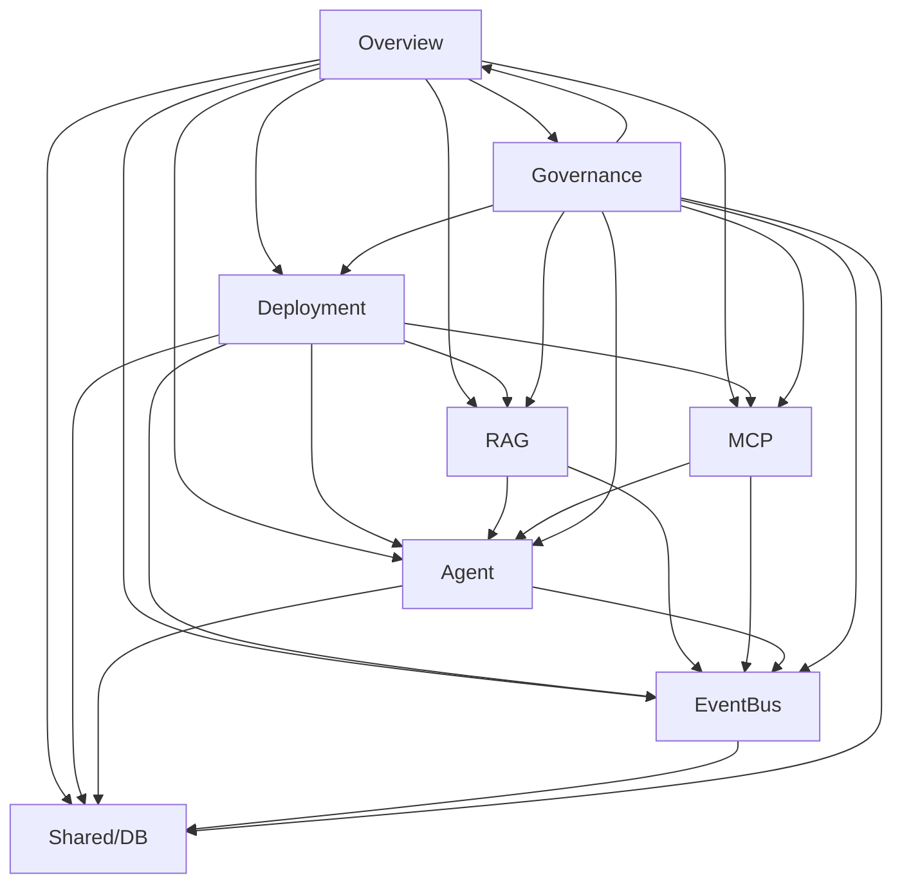

## Canonical-Source Precedence

When conflicts arise between documentation and code/config, the following precedence applies:

| Rank | Source Type | Example | Notes |
|------|-------------|---------|-------|
| 1 | Code | `scripts/eventbus/publisher.py` | Authoritative for runtime behavior |
| 2 | Tests | `tests/eventbus/test_publisher.py` | Authoritative for expected behavior |
| 3 | ADRs | `docs/adrs/ADR-001.md` | Authoritative for architectural decisions |
| 4 | Specifications | `docs/specification.md` | Authoritative for functional requirements |
| 5 | Configuration | `config/system.toml` | Authoritative for operational parameters |
| 6 | Documentation | `docs/architecture.md` | Authoritative for conceptual understanding |

## Area Canonical Maps

### Overview
| Document | Authority | Status |
|----------|-----------|--------|
| docs/00_index.md | Primary | Active |
| docs/architecture.md | Secondary | Active |

### Deployment
| Document | Authority | Status |
|----------|-----------|--------|
| docs/deployment_guide.md | Primary | Active |
| deploy.sh | Operational | Active |

### RAG
| Document | Authority | Status |
|----------|-----------|--------|
| docs/rag/specification.md | Primary | Active |
| scripts/rag/embedding.py | Runtime | Active |

### MCP
| Document | Authority | Status |
|----------|-----------|--------|
| docs/mcp/specification.md | Primary | Active |
| scripts/mcp_servers/*.py | Runtime | Active |

### Agent
| Document | Authority | Status |
|----------|-----------|--------|
| docs/agent/specification.md | Primary | Active |
| scripts/agent/*.py | Runtime | Active |

### EventBus
| Document | Authority | Status |
|----------|-----------|--------|
| docs/eventbus/specification.md | Primary | Active |
| scripts/eventbus/*.py | Runtime | Active |

### Shared/DB
| Document | Authority | Status |
|----------|-----------|--------|
| docs/shared/specification.md | Primary | Active |
| scripts/shared/*.py | Runtime | Active |

### Governance
| Document | Authority | Status |
|----------|-----------|--------|
| docs/00_governance_01_documentation-governance.md | Primary | Active |
| docs/00_governance_02_canonical-source-rule.md | Primary | Active |

## Area Dependency Graph

Permitted dependency directions:

**Cycles prohibited**: No circular dependencies allowed.
**Direction constraint**: Dependencies only flow downward (Overview → Governance).

## Change-Impact Matrix

| Change Type | Architecture Impact | Config Impact | Behavior Impact | Doc-Only Impact | Approval Required |
|-------------|---------------------|---------------|-----------------|-----------------|-------------------|
| Architecture | High | Medium | High | Low | Yes (RACI) |
| Config | Low | High | Medium | Low | Yes (Owner) |
| Behavior | Medium | Low | High | Low | Yes (RACI) |
| Doc-Only | Low | Low | Low | High | No |

## RACI Model

### Overview
| Role | Responsible | Accountable | Consulted | Informed |
|------|-------------|-------------|-----------|----------|
| Architect | @architect | @lead | @dev-team | @stakeholders |
| Developer | @developer | @architect | @reviewer | @team |
| Reviewer | @reviewer | @architect | @developer | @team |

### Deployment
| Role | Responsible | Accountable | Consulted | Informed |
|------|-------------|-------------|-----------|----------|
| DevOps | @devops | @lead | @architect | @team |
| Developer | @developer | @devops | @reviewer | @team |
| Reviewer | @reviewer | @devops | @developer | @team |

### RAG
| Role | Responsible | Accountable | Consulted | Informed |
|------|-------------|-------------|-----------|----------|
| Data Engineer | @data-eng | @lead | @architect | @team |
| Developer | @developer | @data-eng | @reviewer | @team |
| Reviewer | @reviewer | @data-eng | @developer | @team |

### MCP
| Role | Responsible | Accountable | Consulted | Informed |
|------|-------------|-------------|-----------|----------|
| MCP Developer | @mcp-dev | @lead | @architect | @team |
| Developer | @developer | @mcp-dev | @reviewer | @team |
| Reviewer | @reviewer | @mcp-dev | @developer | @team |

### Agent
| Role | Responsible | Accountable | Consulted | Informed |
|------|-------------|-------------|-----------|----------|
| Agent Developer | @agent-dev | @lead | @architect | @team |
| Developer | @developer | @agent-dev | @reviewer | @team |
| Reviewer | @reviewer | @agent-dev | @developer | @team |

### EventBus
| Role | Responsible | Accountable | Consulted | Informed |
|------|-------------|-------------|-----------|----------|
| EventBus Developer | @eventbus-dev | @lead | @architect | @team |
| Developer | @developer | @eventbus-dev | @reviewer | @team |
| Reviewer | @reviewer | @eventbus-dev | @developer | @team |

### Shared/DB
| Role | Responsible | Accountable | Consulted | Informed |
|------|-------------|-------------|-----------|----------|
| DB Admin | @db-admin | @lead | @architect | @team |
| Developer | @developer | @db-admin | @reviewer | @team |
| Reviewer | @reviewer | @db-admin | @developer | @team |

### Governance
| Role | Responsible | Accountable | Consulted | Informed |
|------|-------------|-------------|-----------|----------|
| Governance Lead | @governance-lead | @executive | @all-areas | @team |
| Reviewer | @reviewer | @governance-lead | @all-areas | @team |

## Merge Conditions

### Blocking Conditions (Prevent Merge)
- Critical open issue exists in affected area
- RACI approval not obtained from accountable party
- Canonical source conflict unresolved
- Test suite failing

### Non-Blocking Conditions (Allow Merge with Warning)
- High-severity open issue exists in affected area
- Documentation outdated but code is correct
- Config drift detected but no behavioral impact

### Merge Workflow
1. Check blocking conditions — if any fail, reject merge.
2. If non-blocking conditions exist, add warning to PR description.
3. Obtain RACI approval from accountable party.
4. Resolve canonical source conflicts before merging.
5. Verify test suite passes before merging.
