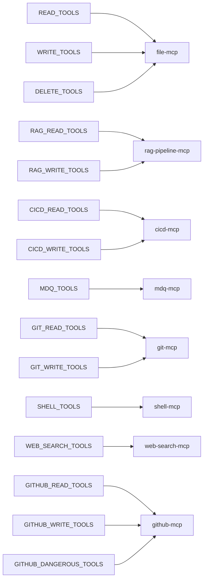

# MCP Tool Ownership Matrix

## Tool-to-MCP Server Mapping

| Tool Name | Owning MCP Server | Capability Group | Risk Tier | Approval Required | Typical Workflow Stage |
|---|---|---|---|---|---|
| list_directory, list_directory_with_sizes, directory_tree, read_text_file, read_media_file, read_multiple_files, search_files, grep_files, get_file_info | file-mcp (port 8004) | READ_TOOLS | LOW | No | plan, verify |
| write_file, edit_file, create_directory, move_file | file-mcp (port 8004) | WRITE_TOOLS | MEDIUM | Yes | execute |
| delete_file, delete_directory | file-mcp (port 8004) | DELETE_TOOLS | HIGH | Yes | execute |
| rag_run_pipeline, rag_debug_pipeline, rag_list_documents | rag-pipeline-mcp (port 8005) | RAG_READ_TOOLS | LOW | No | plan, verify |
| rag_delete_document | rag-pipeline-mcp (port 8005) | RAG_WRITE_TOOLS | HIGH | Yes | execute |
| trigger_workflow | cicd-mcp (port 8006) | CICD_WRITE_TOOLS | HIGH | Yes | execute |
| get_workflow_runs, get_workflow_status, get_workflow_logs | cicd-mcp (port 8006) | CICD_READ_TOOLS | LOW | No | verify |
| search_docs, get_chunk, outline, index_paths, refresh_index, stats, grep_docs | mdq-mcp (port 8007) | MDQ_TOOLS | LOW (READ) / MEDIUM (WRITE) | No (READ) / Yes (index_paths, refresh_index) | plan, verify |
| git_status, git_log, git_diff, git_branch, git_show | git-mcp (port 8014) | GIT_READ_TOOLS | LOW | No | plan, verify |
| git_add, git_commit, git_checkout, git_pull, git_push | git-mcp (port 8014) | GIT_WRITE_TOOLS | MEDIUM | Yes | execute |
| shell_run | shell-mcp (port 8008) | SHELL_TOOLS | MEDIUM | Yes | execute |
| search_web, browser_fetch | web-search-mcp (port 8009) | WEB_SEARCH_TOOLS | LOW | No | plan |
| github_search_repositories, github_list_branches, github_list_commits, github_get_commit, github_search_code, github_get_file_contents, github_list_issues, github_get_issue, github_search_issues, github_list_pull_requests, github_get_pull_request, github_search_pull_requests | github-mcp (port 8012) | GITHUB_READ_TOOLS | LOW | No | plan, verify |
| github_create_branch, github_create_or_update_file, github_push_files, github_create_issue, github_add_issue_comment, github_create_pull_request, github_update_pull_request | github-mcp (port 8012) | GITHUB_WRITE_TOOLS | MEDIUM | Yes | execute |
| github_delete_file, github_merge_pull_request | github-mcp (port 8012) | GITHUB_DANGEROUS_TOOLS | HIGH | Yes | execute |

## Mermaid Diagram

## Design Intent

This document provides a canonical mapping between MCP tools and their owning servers. It serves as the primary reference for understanding which server is responsible for which capability, and for determining risk tiers and approval requirements.

## Current Implementation Behavior

### Risk Classification

- **LOW**: Read-only operations; no approval required
- **MEDIUM**: Write operations that modify state but are not destructive; approval required
- **HIGH**: Operations that can delete data or perform irreversible actions; strict approval required

### Approval Flow

High-risk tools require explicit approval before execution. The approval flow follows the existing `cfg.approval.tool_safety_tiers` logic.

## Responsibility Boundaries

### file-mcp (port 8004)

**Responsibilities:**
- All local file operations (read, write, delete, directory management)
- File metadata retrieval

**Explicit non-responsibilities:**
- Remote repository operations
- Code analysis
- Search across repositories

### rag-pipeline-mcp (port 8005)

**Responsibilities:**
- RAG pipeline execution and debugging
- Document lifecycle management (list, delete)

**Explicit non-responsibilities:**
- Local file operations
- Repository operations
- Code analysis

### cicd-mcp (port 8006)

**Responsibilities:**
- GitHub Actions workflow triggering and monitoring
- CI/CD status reporting

**Explicit non-responsibilities:**
- Local file operations
- Code modification
- Repository content changes

### mdq-mcp (port 8007)

**Responsibilities:**
- Markdown structural search and retrieval
- Index management (create, refresh)
- Documentation statistics

**Explicit non-responsibilities:**
- Local file operations
- Repository operations
- Code analysis beyond markdown structure

### git-mcp (port 8014)

**Responsibilities:**
- Local Git operations (status, log, diff, branch, commit, push/pull)
- Git history inspection

**Explicit non-responsibilities:**
- Remote repository content modification
- File content analysis
- RAG operations

### shell-mcp (port 8008)

**Responsibilities:**
- Shell command execution

**Explicit non-responsibilities:**
- File operations
- Repository operations
- Network requests

### web-search-mcp (port 8009)

**Responsibilities:**
- Web search
- Browser page fetch and text extraction

**Explicit non-responsibilities:**
- Local file operations
- Repository operations
- Code modification

### github-mcp (port 8012)

**Responsibilities:**
- GitHub repository operations (search, branches, commits, issues, PRs)
- Code content retrieval
- Branch/commit/PR creation and modification
- Dangerous operations (file deletion, PR merging)

**Explicit non-responsibilities:**
- Local file operations
- RAG operations
- CI/CD operations

## Unconfirmed Items

- [NC-003](00_governance_07_needs-confirmation-inventory.md#nc-003): Tool capability naming convention enforcement

## Related Documents

- [MCP Documentation Guide](04_mcp_00_document-guide.md)
- [MCP Service Boundaries](04_mcp_02_service_boundaries.md)
- [Web Search, File Read, GitHub](04_mcp_04_01_web-search-file-read-github.md)

## Keywords

mcp
tools
ownership
matrix
routing
