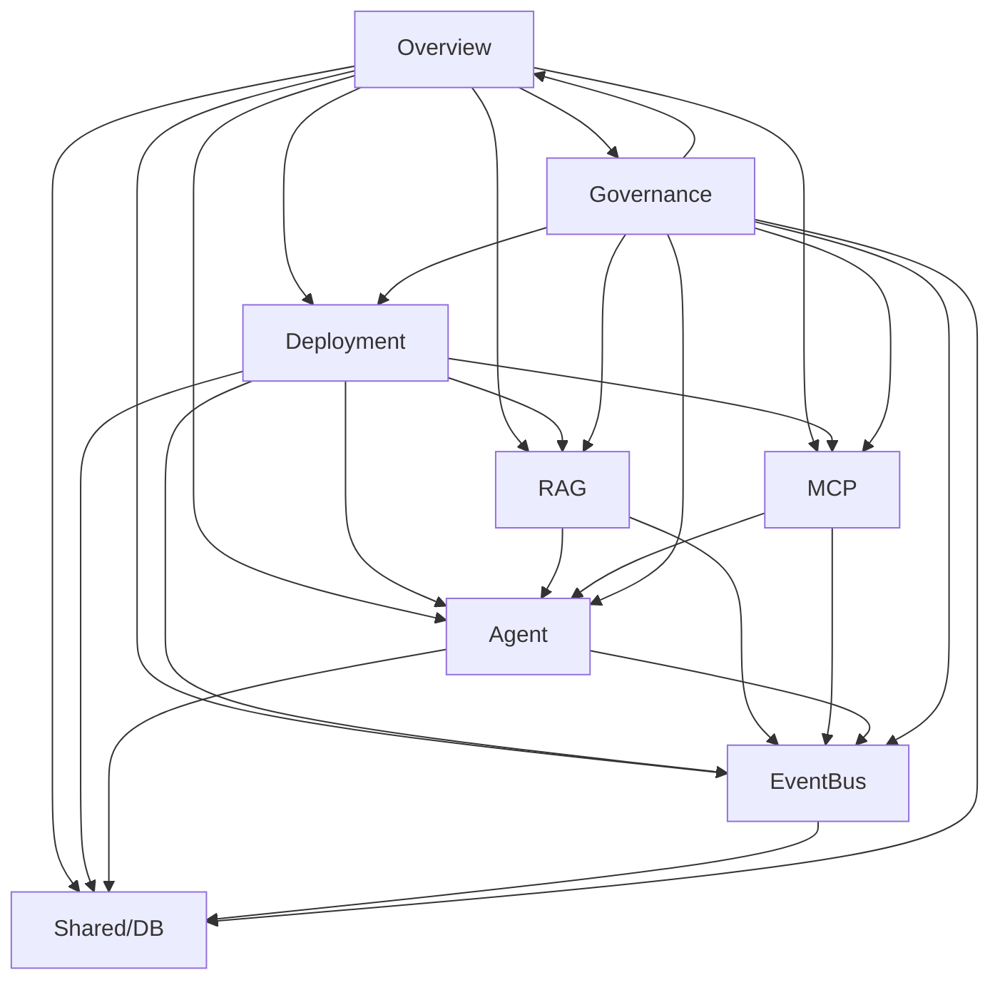

## Goal
Remove `docs/00_governance_04_documentation-checks.md`'s duplicate mermaid copy of
the (now-removed, per seq 01) cyclic Area Dependency Graph, make section 12
reference `docs/00_governance_01_documentation-policy.md` as the single canonical
source and describe the new automated cycle check, update `GV-015`'s `Status` to
reflect that the graph-type separation now exists, and update the Change Impact
Assessment to select among the four new relation types by change category (mirroring
seq 01's Change Impact Rule update in `docs/00_governance_01_documentation-policy.md`).

## Scope
- **In-Scope**: `docs/00_governance_04_documentation-checks.md` only — section 12
  ("### 12. Area Dependency Graph Validation"), the `GV-015` row and its
  `### Follow-up Work Needed` item 10 in the Governance Verification Matrix, and
  `## Change Impact Assessment` (steps 1-2).
- **Out-of-Scope**: `GV-016` (a broader, unrelated audit gap about undocumented
  auto-check claims in general — this Plan's Requirements include no REQ targeting
  it; it self-flagged this dependency-graph gap only as one example among possibly
  others, and fixing this one example does not close the general audit item).
  `docs/00_governance_01_documentation-policy.md` itself (seq 01).
  `docs/00_governance_03_issue-and-uncertainty-management.md` NC entries (seq 03).
  The new tool and its test (seq 04/05). The CI workflow step (seq 06). De-duplicating
  this document's `## Change Impact Assessment` against
  `docs/00_governance_01_documentation-policy.md`'s `## Change Impact Rule` (the two
  are a separate, pre-existing content duplication the Plan's Background does not
  flag as in-scope — only the section-12 graph duplication is called out).

## Assumptions
- Section 12 keeps its existing heading text and its position under `## Manual
  Checks` (items 9-14) rather than moving to `## Automated Checks` (items 1-8),
  because the section as a whole is not fully automated — only the Software Runtime
  Dependency Graph's cycle-freedom is (via the new tool); the Deployment Management
  Graph, Documentation Reference Graph, and Governance Applicability Matrix remain
  human-reviewed. Splitting this into "automated part" + "manual part" documentation
  within the same numbered item avoids a `GV-016`-style false claim ("documented as
  implemented" for parts that are not).
- `GV-015`'s `Status` moves from `Missing` to `Existing` (the value already used
  elsewhere in this table for present-and-adequate rules, e.g. `GV-001`, `GV-005`),
  not to a bespoke value like `Resolved`, to keep the `Status` column's existing
  enumeration unchanged (`Existing`, `Missing`, `Partial`).

## Design decisions
- **Section 12 rewrite keeps the item number and heading unchanged**: no other
  document links to this heading by anchor (verified in seq 01's `grep`, which
  searched this file too), so renaming carries no benefit and would be an
  unnecessary consistency change beyond REQ-003's actual requirement (remove
  duplication + cite canonical source + describe the new check).
- **`GV-015` closing reference cites the source issue**, not the Plan file itself,
  because the Plan (`plans/20260902-191512_plan.md`) will be moved to `plans/done/`
  once this Plan's own workflow completes (per `rules/workflow-lifecycle.md`), while
  the source issue (`issues/done/20260902-102831_depgraph_...md`) is the stable,
  already-archived identifier this table's `Follow-up`/closing-reference convention
  elsewhere in the repo uses (see `GV-014`'s existing "Resolved —" style entry, which
  this edit mirrors).
- **Change Impact Assessment steps 1-2 mirror seq 01's Change Impact Rule edit
  verbatim** (same category list, same graph/matrix selection logic), rather than
  being independently worded, because both sections currently carry identical text
  and nothing in this Plan's Requirements calls for them to diverge — keeping them
  textually identical (even though still duplicated as two copies) avoids
  introducing a *new* inconsistency while not taking on the separate, out-of-scope
  task of merging them into one canonical copy.

## Alternatives considered
- **Move section 12 to `## Automated Checks` since part of it is now tool-enforced**
  — rejected (see Assumptions): the section covers 4 relation types and only 1 is
  automated; moving the whole item would misrepresent the other 3 as automated,
  which is exactly the failure mode `GV-016` exists to catch.
- **De-duplicate `## Change Impact Assessment` into a one-line reference to
  `docs/00_governance_01_documentation-policy.md`'s `## Change Impact Rule`**
  (matching the section-12 approach) — considered, since REQ-003's own precedent
  ("reference as canonical instead of duplicating") could plausibly extend here.
  Rejected because REQ-006 explicitly describes updating *both* copies' content
  ("Change Impact Rule ... and ... Change Impact Assessment MUST select ..."),
  not consolidating them into one; the existing duplication between the two rules is
  a separate, pre-existing condition this Plan's Background never calls out as a
  problem (unlike the section-12 graph duplication, which Background explicitly
  identifies by line number in both files) — de-duplicating it now would be a Plan
  Gap, reported here rather than acted on unilaterally.
- **Set `GV-015` `Status` to a new value like `Resolved`** — rejected in favor of
  reusing `Existing` (see Assumptions) to avoid growing the column's value
  enumeration without a corresponding Plan requirement to do so.

## Implementation
### Target file
`docs/00_governance_04_documentation-checks.md`

### Procedure
1. Re-read the current file in full immediately before editing (line numbers below
   were confirmed 2026-09-03 against this file's current content — section 12 at
   lines 182-224, `GV-015` row at line 287, Follow-up item 10 at line 311, Change
   Impact Assessment at lines 316-323 — matching the Plan's own Frozen evidence with
   no drift; re-confirm before applying any edit).
2. Replace `### 12. Area Dependency Graph Validation`'s body (currently lines
   184-223, i.e. from "Permitted dependency directions only:" through the
   `**Direction constraint**` line, leaving the `### 12. …` heading itself and the
   blank line before `### 13. Merge Condition Validation` unchanged) with the
   canonical-source-reference + automated-check description in Details below.
3. Replace the `GV-015` row (currently line 287) in the Governance Verification
   Matrix table with the updated row in Details below.
4. Replace Follow-up Work Needed item 10 (currently line 311) with the updated item
   in Details below.
5. Replace `## Change Impact Assessment` steps 1-2 (currently lines 320-321) with
   the same rewrite applied to `docs/00_governance_01_documentation-policy.md`'s
   Change Impact Rule in seq 01, given in Details below.

### Method
Direct text edit (e.g. via the `Edit` tool) using the exact before/after blocks in
Details, as four independent edits (section 12 body, the `GV-015` row, Follow-up
item 10, and Change Impact Assessment steps 1-2 are not textually adjacent).

### Details

**Edit 1 — section 12 body**:

Before:
```
### 12. Area Dependency Graph Validation

Permitted dependency directions only:



**Cycles prohibited**: No circular dependencies allowed.
**Direction constraint**: Dependencies only flow downward (Overview → Governance).
```

After:
```
### 12. Area Dependency Graph Validation

Canonical source: the dependency-graph taxonomy (Software Runtime Dependency Graph,
Deployment Management Graph, Documentation Reference Graph, Governance Applicability
Matrix) is defined in `docs/00_governance_01_documentation-policy.md` — see that
document's sections by these names. This document does not duplicate the edge list.

**Automated** (Software Runtime Dependency Graph only): `tools/check_dependency_graph_cycles.py`
parses the Software Runtime Dependency Graph's edge list from
`docs/00_governance_01_documentation-policy.md` and fails if a cycle exists among its
5 in-scope nodes (Agent, MCP, RAG, EventBus, Shared/DB). Wired into
`.github/workflows/governance-docs-consistency.yml`.

**Manual** (all other relation types): the Deployment Management Graph, Documentation
Reference Graph, and Governance Applicability Matrix are not cycle-checked by any
tool — see each section's own cycle-tolerance statement in
`docs/00_governance_01_documentation-policy.md` — and remain subject to human review
only.
```

**Edit 2 — `GV-015` row**:

Before:
```
| GV-015 | Software vs Documentation dependency graph separation | Pol | Manual | Human review | PR | Warning | Missing | Register Known Issue |
```

After:
```
| GV-015 | Software vs Documentation dependency graph separation | Pol | Manual | Human review | PR | Warning | Existing | None |
```

**Edit 3 — Follow-up Work Needed item 10**:

Before:
```
10. **GV-015**: Separate dependency graph analysis by type
```

After:
```
10. **GV-015**: Resolved — `docs/00_governance_01_documentation-policy.md`'s
   Software Runtime Dependency Graph, Deployment Management Graph, Documentation
   Reference Graph, and Governance Applicability Matrix sections separate the four
   relation types the previous single graph conflated; closing reference:
   `issues/done/20260902-102831_depgraph_area-dependency-graph-cycle-and-relationship-conflation.md`.
```

**Edit 4 — Change Impact Assessment steps 1-2**:

Before:
```
1. Identify the change category (architecture, configuration, command, behavioral, documentation-only)
2. Map the change to affected areas using the area dependency graph
```

After:
```
1. Identify the change category (architecture, configuration, command, behavioral, deployment, governance-policy, documentation-only)
2. Select which relation type governs the change, by category:
   - Architecture, behavioral, or command changes → Software Runtime Dependency Graph
   - Deployment changes → Deployment Management Graph
   - Documentation-only changes → Documentation Reference Graph
   - Governance-policy changes → Governance Applicability Matrix
   - Configuration or API changes → continue to use the existing Canonical Source
     Precedence matrix (Decision Target Canonical Source Matrix); no separate
     Configuration Ownership Map or API Consumer Map exists (tracked as a Needs
     Confirmation entry in `docs/00_governance_03_issue-and-uncertainty-management.md`)

   Map the change to the areas or components covered by the selected graph or matrix.
```
(identical to seq 01's Edit 4 for `docs/00_governance_01_documentation-policy.md`'s
Change Impact Rule — see Design decisions for why the two copies are kept textually
identical rather than de-duplicated.)

## Compatibility considerations
No other live document links to `### 12. Area Dependency Graph Validation` by
markdown anchor (verified by seq 01's repository-wide `grep`, which covered this
file). This row depends on seq 01 having already replaced
`docs/00_governance_01_documentation-policy.md`'s graph sections — apply seq 01
before this row, since Edit 1's "Automated" paragraph and Edit 4 both name the new
sections by their seq-01-introduced titles.

## Security considerations
None — documentation-only change to governance policy/checks text.

## Rollback considerations
Single-file, four-edit change to a Markdown document under version control; revert
via `git revert`. No other file's content depends on the removed mermaid block or
the exact old `GV-015`/Follow-up text (see Compatibility considerations).

## Validation plan
| Target File/Module | Testing Strategy | Tool / Command to Run | Expected Outcome |
|---|---|---|---|
| docs/00_governance_04_documentation-checks.md | Automated doc structure/quality check | `uv run python tools/check_docs_quality.py` | No new errors |
| docs/00_governance_04_documentation-checks.md | Automated doc structure check | `uv run python tools/check_docs_structure.py docs/00_governance_04_documentation-checks.md` | No new errors, no broken links introduced |
| docs/00_governance_04_documentation-checks.md | Manual review | Re-read section 12, the `GV-015` row, Follow-up item 10, and Change Impact Assessment | Section 12 contains no edge list and cites `docs/00_governance_01_documentation-policy.md` as canonical; `GV-015` Status is `Existing`; Change Impact Assessment names all four graphs/matrix by category |

## Completion criteria
- Section 12 no longer contains a mermaid (or any) copy of the edge list; it names
  `docs/00_governance_01_documentation-policy.md` as canonical and describes the new
  automated cycle check (AC-3).
- `GV-015`'s `Status` no longer reads `Missing` (AC-4).
- Change Impact Assessment states which of the four graphs/matrix applies per change
  category and states that configuration/API changes use the existing Canonical
  Source Precedence matrix (AC-6).
- `uv run python tools/check_docs_quality.py` and `uv run python
  tools/check_docs_structure.py docs/00_governance_04_documentation-checks.md`
  report no new errors.

## Out of scope
`GV-016`, de-duplicating Change Impact Assessment against Change Impact Rule (see
Scope/Design decisions). `docs/00_governance_01_documentation-policy.md` (seq 01),
`docs/00_governance_03_issue-and-uncertainty-management.md` (seq 03), the new tool
and test (seq 04/05), the CI workflow step (seq 06) — each has its own
implementation-procedure document per this Plan's Implementation Target Files table.

## Execution Status

### Execution Status
| Step | Description | Status | Started | Completed | Notes |
|------|-------------|--------|---------|-----------|-------|
| 1 | Implement the change described in Implementation > Procedure/Method/Details | Pending | — | — | Apply after seq 01 (see Compatibility considerations) |
| 2 | Add or update tests per Validation plan | Pending | — | — | N/A: documentation-only row, no test file owned by this row |
| 3 | Run the validation sequence (`rules/toolchain.md`) | Pending | — | — | |
| 4 | Update documentation, if in scope per Compatibility/Out of scope | Pending | — | — | |

### Blocker Log
| Step | Blocker Description | Resolved | Resolution Date |
|------|---------------------|----------|-----------------|
| — | — | — | — |

### Work Items Created
| Item ID | Related Step | Type | Status | Owner | Due Date |
|---------|--------------|------|--------|-------|----------|
| — | — | — | — | — | — |

## Traceability
- **Workflow phase**: plan-to-implementation-procedure
- **Requirement ID**: REQ-003, REQ-004, REQ-006
- **Source issue**: issues/done/20260902-102831_depgraph_area-dependency-graph-cycle-and-relationship-conflation.md
- **Source requirement**: N/A: no standalone requirement document is generated
- **Source plan**: plans/20260902-191512_plan.md
- **Source implementation procedure**: N/A: this document is the generated implementation procedure
- **Generated at**: 20260903-142052
- **Related target files**: docs/00_governance_04_documentation-checks.md
