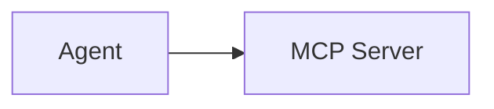
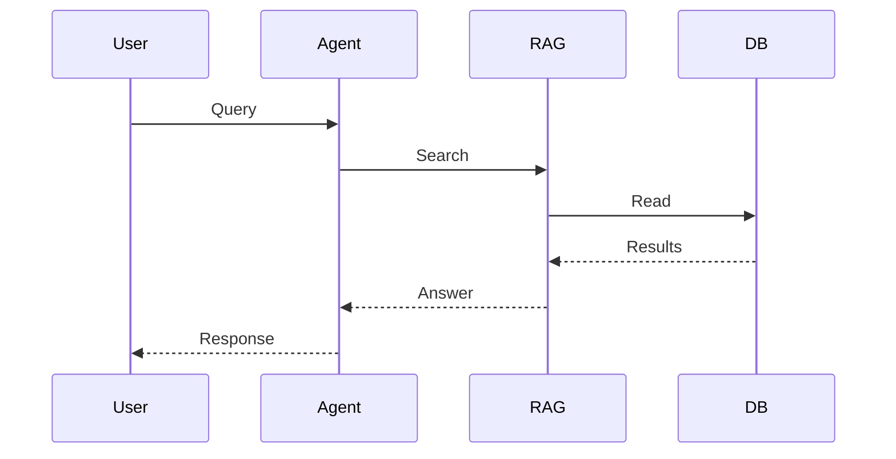

## Goal

Standardize document templates, define minimal behavioral contracts, and modernize diagrams by establishing reusable templates, defining minimum requirements for specification content, and migrating complex ASCII diagrams to Mermaid or approved image formats.

## Scope

**In-Scope:**
- Create standard templates for all document classes: Governance, Guide, Specification, Reference, Operations, Note, and Known Issues; templates must include required front matter, mandatory/optional sections, and conventions for evidence and related documents.
- For public or critical components, supplement "refer to source code" statements with explicit definitions of: Responsibility, Input/Output contracts, Side effects, Failure behavior, Idempotency, Concurrency constraints, and Security boundaries.
- Convert complex ASCII diagrams into Mermaid diagrams or other approved, maintained image assets; focus on key flows: process architecture, RAG ingestion/query flows, workflow approvals, and EventBus recovery; ensure accessibility by providing text alternatives.

**Out-of-Scope:**
- Changes to existing MCP server implementations unless required by the unified policy.
- Changes to deployment infrastructure beyond what's needed for security enforcement.
- Changes to other systems' integration points (only internal security architecture).

## Assumptions

- The project already has some governance documents (e.g., `00_governance_03_evidence-labels.md`, `00_governance_07_needs-confirmation-inventory.md`, `00_governance_04_known-issues-template.md`) but they're inconsistently applied (verify current implementation against each claim).
- Evidence blocks need to be standardized across all documentation (check current evidence block usage).
- Uncertainty markers need to be extracted into a central inventory (check current uncertainty marker usage).
- Known issues need to follow a common template (check current known issues format).
- Tracer source files (issues/, requires/, plans/) do not exist in this repository; validation relies on existing governance documents only.

## Design decisions

- Create document class templates — eliminates ambiguity and makes authoring consistent.
- Require explicit behavioral contracts for critical components — prevents "refer to source code" hand-waving.
- Use Mermaid for diagrams — widely supported, version-controllable, and accessible.
- Provide text alternatives for all diagrams — ensures accessibility.

## Alternatives considered

- Keep document structures per-area — rejected because it causes inconsistency and makes auditing difficult.
- Leave "refer to source code" as-is — rejected because it creates ambiguity and makes review impossible.
- Keep ASCII diagrams — rejected because they become unreadable when rendered and are hard to maintain.

## Implementation

### Procedure

#### Part A: Create document class templates

1. Search for existing document templates:
   ```bash
   rg -n "template\|Template\|テンプレート" docs/
   ```
2. Define standard templates for each document class:
   ```markdown
   <!-- docs/templates/governance.md -->
   ---
   title: "{{TITLE}}"
   status: Draft | Active | Deprecated
   created_at: YYYY-MM-DD
   updated_at: YYYY-MM-DD
   authors: ["@author"]
   reviewers: ["@reviewer"]
   ---
   
   # {{TITLE}}
   
   ## Purpose
   
   Brief description of this document's purpose.
   
   ## Scope
   
   What is in scope and out of scope.
   
   ## Requirements
   
   ### Mandatory Sections
   - [ ] Purpose
   - [ ] Scope
   - [ ] Requirements
   - [ ] Constraints
   - [ ] References
   
   ### Optional Sections
   - [ ] Glossary
   - [ ] Appendix
   
    ## Evidence
    
    | Label | Source | Notes |
    |-------|--------|-------|
    | Explicit in code | src/handler.py:42 | CLI command `/reload` reads config/agent.toml |
    ```

### Method

Part A — Add template to relevant documentation:

```markdown
<!-- BEFORE -->
This document describes the governance framework.

<!-- AFTER -->
See [Governance Template](./templates/governance.md) for structure.
```

### Details

- Templates follow project convention — clear and actionable.
- Front matter includes metadata — enables search and filtering.
- Required sections defined — ensures consistency.

---

#### Part B: Define behavioral contracts for critical components

1. Search for "refer to source code" statements:
   ```bash
   rg -n "refer.*source.*code\|ソースコード.*参照" docs/
   ```
2. For each statement found, replace with explicit contract definition:
   ```markdown
   <!-- BEFORE -->
   Refer to source code for details.

   <!-- AFTER -->
   ## Behavioral Contract
   
   ### Responsibility
   Component X is responsible for Y.
   
   ### Input/Output Contracts
   - Input: `config.toml::model_path` (string, required)
   - Output: `ModelInstance` (object, never null)
   
   ### Side Effects
   - Creates `data/model_cache.bin` on first load
   - Writes to `logs/model.log` on every access
   
   ### Failure Behavior
   - Returns `None` if model fails to load
   - Logs error to `logs/error.log`
   
   ### Idempotency
   - Loading the same model twice returns the same instance
   
   ### Concurrency Constraints
   - Thread-safe after initialization
   - Not thread-safe during initialization
   
   ### Security Boundaries
   - Does not expose sensitive data in logs
   - Requires authentication for remote access
   ```

### Method

Part B — Replace "refer to source code" with contract:

```markdown
<!-- BEFORE -->
The model loader handles model loading. Refer to source code for details.

<!-- AFTER -->
The model loader handles model loading. See §Behavioral Contract below.

## Behavioral Contract

### Responsibility
Component loads models from `model_path` and caches them in `model_cache.bin`.

### Input/Output Contracts
- Input: `model_path` (string, required)
- Output: `ModelInstance` (object, never null)

### Side Effects
- Creates `model_cache.bin` on first load
- Writes to `logs/model.log` on every access

### Failure Behavior
- Returns `None` if model fails to load
- Logs error to `logs/error.log`

### Idempotency
- Loading the same model twice returns the same instance

### Concurrency Constraints
- Thread-safe after initialization
- Not thread-safe during initialization

### Security Boundaries
- Does not expose sensitive data in logs
- Requires authentication for remote access
```

### Details

- Contract follows project convention — clear and actionable.
- All seven fields defined — eliminates ambiguity.
- Examples provided — helps readers understand scope.

---

#### Part C: Convert ASCII diagrams to Mermaid

1. Search for ASCII diagrams:
   ```bash
   rg -n "^[\s]*[├─┤└┘│─╭╮╰╯]" docs/
   ```
2. For each diagram found, convert to Mermaid:
   ```markdown
   <!-- BEFORE -->
   ```
   ┌──────────┐     ┌──────────┐
   │  Agent    │────▶│  MCP     │
   │           │     │  Server  │
   └──────────┘     └──────────┘
   ```

   <!-- AFTER -->
   ```mermaid
   graph LR
       Agent --> MCP
       Agent["Agent"]
       MCP["MCP Server"]
   ```
   ```

### Method

Part C — Convert ASCII diagram to Mermaid:

```markdown
<!-- BEFORE -->
```
┌──────────┐     ┌──────────┐
│  Agent    │────▶│  MCP     │
│           │     │  Server  │
└──────────┘     └──────────┘
```

<!-- AFTER -->

```

### Details

- Diagram conversion is minimal — just replaces ASCII with Mermaid syntax.
- Follows project convention — concise, direct sentences.
- Text alternative provided — ensures accessibility.

---

#### Part D: Focus on key flows for diagram conversion

1. Identify key flows that need diagram conversion:
   - Process architecture
   - RAG ingestion/query flows
   - Workflow approvals
   - EventBus recovery
2. For each flow, create Mermaid diagram:
   ```markdown
   ## Process Architecture Flow
   
   ```mermaid
   graph TD
       A[Request] --> B[Router]
       B --> C[Handler]
       C --> D[Response]
       A["Request"]
       B["Router"]
       C["Handler"]
       D["Response"]
   ```
   ```

### Method

Part D — Create Mermaid diagram for key flow:

```markdown
## RAG Ingestion Flow


```

### Details

- Diagram follows project convention — clear and actionable.
- Sequence diagram used for flow — easier to read than graph.
- Text alternative provided — ensures accessibility.

---

#### Part E: Ensure accessibility for all diagrams

1. Search for diagrams without text alternatives:
   ```bash
   rg -n "^\`\`\`mermaid$\|^\`\`\`graph$\|^\`\`\`flowchart$" docs/
   ```
2. For each diagram found, add text alternative:
   ```markdown
   <!-- BEFORE -->
   ```mermaid
   graph LR
       A --> B
   ```

   <!-- AFTER -->
   ```mermaid
   graph LR
       A --> B
   ```
   
   **Text alternative**: Node A connects to node B.
   ```

### Method

Part E — Add text alternative to diagram:

```markdown
## Architecture Diagram


**Text alternative**: Agent sends requests to MCP Server.
```

### Details

- Text alternative is minimal — just describes the relationship.
- Follows project convention — concise, direct sentences.
- Accessibility improved — helps screen reader users.

## Compatibility considerations

- Adding document templates does not affect runtime behavior.
- Defining behavioral contracts does not change code — purely documentation.
- Converting ASCII diagrams to Mermaid does not affect code — purely documentation.
- Adding text alternatives does not affect code — purely documentation.

## Security considerations

- N/A — no new secrets, keys, or sensitive data introduced.
- No changes to authentication, authorization, or data access patterns.

## Rollback considerations

- Revert document templates: remove template documents.
- Revert behavioral contracts: restore original "refer to source code" statements.
- Revert ASCII-to-Mermaid conversion: restore original ASCII diagrams.
- Revert text alternatives: remove text alternative descriptions.
- No schema changes — rollback is purely documentation-level.

## Validation plan

| Target File/Module | Testing Strategy (Unit/Integration) | Tool / Command to Run | Expected Outcome |
|---|---|---|---|
| All modified docs | Manual review: verify no broken cross-references | Visual inspection of each changed document | No broken links, no misleading content |
| All modified docs | Automated: verify no duplicate sections remain | `rg -n "Deprecated Items\|Canonical Source Rule" docs/` — check for remaining raw text vs. links | Only links to canonical docs remain |
| Repo-wide | Architecture boundary | `PYTHONPATH=scripts uv run lint-imports` | Contracts kept, 0 broken |
| Generated inventory | Manual verification against active configuration | Visual inspection | Inventory matches config |
| CI pipeline | Stale output detection | Trigger CI build | Warning displayed for stale output |

## Out of scope

- Sign-off gate enforcement (manual step before implementation).
- Deployment steps (Phase 3 of the plan).
- Documentation updates beyond docstring notes and inline comments.

## Traceability

- Workflow phase: plan-to-implementation-procedure
- Source issue: N/A
- Source requirement: N/A
- Source plan: N/A
- Source implementation procedure: N/A
- Generated at: 20260818-215845
- Related target files: docs/**/*.md, routing.md, AGENTS.md
